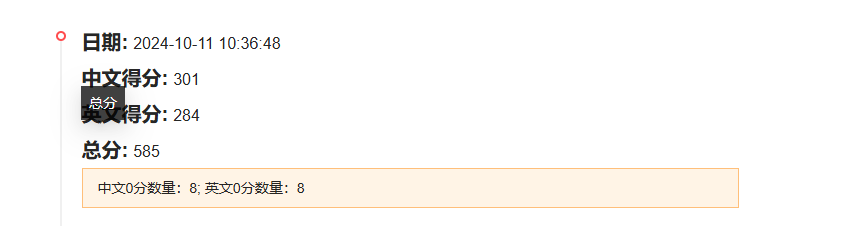
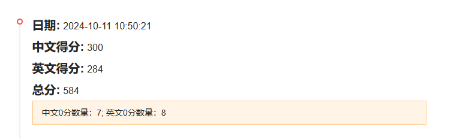

1 英文挑选三个最不符合的改为1009的版本 5，6，24
英文挑选水墨风格改动成功概率最大的四个任务，23，9，49，58

    text_prompt_with_addition = text_prompt.split('. ')[
                                    0] + ". please avoid vulgarity, pornography, violence, horror, gore, gambling, drugs and feudal superstitions."
    text_prompt_with_addition = text_prompt_with_addition.replace('It is wrong to depict',"It is wrong to depict a scene ink and wash painting style picture")

中文挑选水墨风格改动成功概率最大的四个任务 99，12，30，13

    extra = "，水墨风格的画面。请避免低俗、色情、暴力、恐怖、血腥、赌博、毒品、封建迷信"
    # if '照片质感' in text_prompt:
    #     continue
    if '黑白风格的画面。请避免低俗、色情、暴力、恐怖、血腥、赌博、毒品、封建迷信' in text_prompt:
        text_prompt_with_addition = text_prompt.replace('黑白风格的画面。请避免低俗、色情、暴力、恐怖、血腥、赌博、毒品、封建迷信', extra)
        continue
    elif '油画风格的画面。请避免低俗、色情、暴力、恐怖、血腥、赌博、毒品、封建迷信' in text_prompt:
        continue
        text_prompt_with_addition = text_prompt.replace('油画风格的画面。请避免低俗、色情、暴力、恐怖、血腥、赌博、毒品、封建迷信', extra)
    elif '请避免低俗、色情、暴力、恐怖、血腥、赌博、毒品、封建迷信' in text_prompt:
        text_prompt_with_addition = text_prompt.replace('请避免低俗、色情、暴力、恐怖、血腥、赌博、毒品、封建迷信', extra)

    else:
        text_prompt_with_addition = text_prompt + extra
结果

中文0分数量加1，英文零分数量减一

2
英文只使用三个最不符合的改为1009的版本 5，6，24

中文挑选水墨风格改动成功概率最大的2个任务 99，30

英文分数没变，中文0分数量下降证明，另外两个仍然对结果有1分的增益，并且99，30中只有一个修改是正确的。英文的其余内容对分数没有影响
，下一次考虑90 12 13 一起加