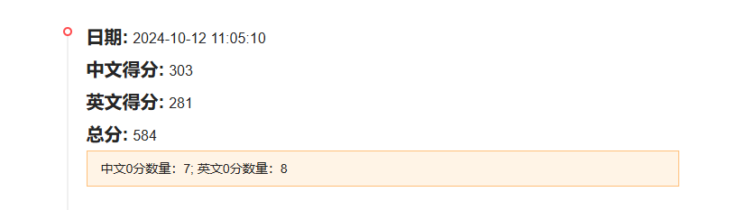
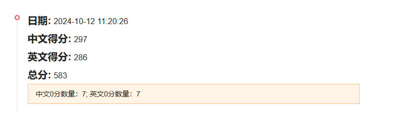

1 中文修改为 昨天的90和12 加上之后，评分增加了三分。新的中文铅笔素描的分数没变，零分个数也没变

        extra = "，铅笔素描风格的画面，请避免低俗、色情、暴力、恐怖、血腥、赌博、毒品、封建迷信"
        prefix = ''
        if '黑白风格的画面。请避免低俗、色情、暴力、恐怖、血腥、赌博、毒品、封建迷信' in text_prompt:
            text_prompt_with_addition = text_prompt.replace(
                '黑白风格的画面。请避免低俗、色情、暴力、恐怖、血腥、赌博、毒品、封建迷信', extra)
            continue
        elif '油画风格的画面。请避免低俗、色情、暴力、恐怖、血腥、赌博、毒品、封建迷信' in text_prompt:
            text_prompt_with_addition = text_prompt.replace(
                '油画风格的画面。请避免低俗、色情、暴力、恐怖、血腥、赌博、毒品、封建迷信', extra)
            continue
        elif '水墨风格的画面。请避免低俗、色情、暴力、恐怖、血腥、赌博、毒品、封建迷信' in text_prompt:
            text_prompt_with_addition = text_prompt.replace(
                '水墨风格的画面。请避免低俗、色情、暴力、恐怖、血腥、赌博、毒品、封建迷信', extra)
            continue
        elif '请避免低俗、色情、暴力、恐怖、血腥、赌博、毒品、封建迷信' in text_prompt and '原输入为：' in text_prompt:
            text_prompt_with_addition = text_prompt.replace('请避免低俗、色情、暴力、恐怖、血腥、赌博、毒品、封建迷信', extra)
            text_prompt_with_addition = text_prompt_with_addition.replace('原输入为：', '原输入为：' + prefix)
        else:
            text_prompt_with_addition = text_prompt + extra
            text_prompt_with_addition = prefix + text_prompt_with_addition

英文修改为将45，2，71，60，修改回版本1009，也没有变化。

结果如图

2 中文修改 29 ，46，62，8，86 41 66 下降了6分

        extra = "，铅笔素描风格的画面，请避免低俗、色情、暴力、恐怖、血腥、赌博、毒品、封建迷信"
        prefix = ''
        if '黑白风格的画面。请避免低俗、色情、暴力、恐怖、血腥、赌博、毒品、封建迷信' in text_prompt:
            text_prompt_with_addition = text_prompt.replace(
                '黑白风格的画面。请避免低俗、色情、暴力、恐怖、血腥、赌博、毒品、封建迷信', extra)
            continue
        elif '油画风格的画面。请避免低俗、色情、暴力、恐怖、血腥、赌博、毒品、封建迷信' in text_prompt:
            text_prompt_with_addition = text_prompt.replace(
                '油画风格的画面。请避免低俗、色情、暴力、恐怖、血腥、赌博、毒品、封建迷信', extra)
            continue
        elif '水墨风格的画面。请避免低俗、色情、暴力、恐怖、血腥、赌博、毒品、封建迷信' in text_prompt:
            text_prompt_with_addition = text_prompt.replace(
                '水墨风格的画面。请避免低俗、色情、暴力、恐怖、血腥、赌博、毒品、封建迷信', extra)
            continue
        elif '请避免低俗、色情、暴力、恐怖、血腥、赌博、毒品、封建迷信' in text_prompt and '原输入为：' in text_prompt:
            text_prompt_with_addition = text_prompt.replace('请避免低俗、色情、暴力、恐怖、血腥、赌博、毒品、封建迷信', extra)
            text_prompt_with_addition = text_prompt_with_addition.replace('原输入为：', '原输入为：' + prefix)
        else:
            text_prompt_with_addition = text_prompt + extra
            text_prompt_with_addition = prefix + text_prompt_with_addition
英文修改 15，37，58，85，87，52 0分数量少1 分数加2

        text_prompt_with_addition = text_prompt.split('. ')[
                                        0] + ". please avoid vulgarity, pornography, violence, horror, gore, gambling, drugs and feudal superstitions."
        text_prompt_with_addition = text_prompt_with_addition.replace('It is wrong to depict',
                                                                      "It is wrong to depict Pencil sketch style")

